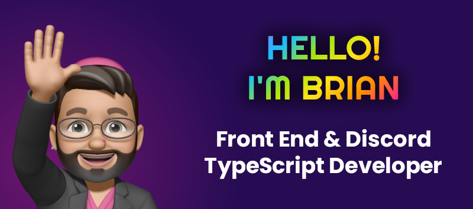

# Hi I'm Brian

  

Hello, I'm Brian. I’m a seasoned IT professional with over 20 years of experience. These days, I’m diving deep into TypeScript and crafting powerful and user-friendly Discord applications. I also enjoy getting hands-on with Front-End Web Development and WordPress projects.

## Projects

I created <a href="https://github.com/SparkBotDev">Spark⚡️Bot</a> to provide a framework for Discord applications that I build. It is a feature rich, blazingly fast framework built to run on Bun. I design with the idea that others can use it for their applications as well, so it includes plugin support and easy configuration.

 
 

<a href="https://valibot.dev">Valibot</a> is a JS data validation library. I provide Discord server administration and development for the project.

 
 

I created the <a href="https://lister.design/#fabulous">Fabulous Design Kit</a> to be a comprehensive tool suite that assists web designers and developers in easily creating exceptional websites and applications that adhere to industry standards.

 
 

<a href="https://elad2412.github.io/the-new-css-reset">The New CSS Reset</a> is a modern reset with a completely new approach. This reset is the basis of the reset in the Fabulous CSS Library, and I contribute fixes back to it when I discover them.

 
 

## Skills & Tech Stack

### Top Five

<a href="https://www.typescriptlang.org">
  <picture>
    <source media="(prefers-color-scheme: dark)" srcset="./assets/images/skills/ts.svg">
    <source media="(prefers-color-scheme: light)" srcset="./assets/images/skills/ts.svg">
    
  </picture>
</a>
<a href="hhttps://discord.com/developers/docs/intro">
  <picture>
    <source media="(prefers-color-scheme: dark)" srcset="./assets/images/skills/discord.svg">
    <source media="(prefers-color-scheme: light)" srcset="./assets/images/skills/discord.svg">
    
  </picture>
</a>
<a href="https://developer.mozilla.org/en-US/docs/Web/HTML">
  <picture>
    <source media="(prefers-color-scheme: dark)" srcset="./assets/images/skills/html.svg">
    <source media="(prefers-color-scheme: light)" srcset="./assets/images/skills/html.svg">
    
  </picture>
</a>
<a href="https://developer.mozilla.org/en-US/docs/Web/CSS">
  <picture>
    <source media="(prefers-color-scheme: dark)" srcset="./assets/images/skills/css.svg">
    <source media="(prefers-color-scheme: light)" srcset="./assets/images/skills/css.svg">
    
  </picture>
</a>
<a href="https://learn.microsoft.com/en-us/mem/configmgr/mdt">
  <picture>
    <source media="(prefers-color-scheme: dark)" srcset="./assets/images/skills/win-dk.svg">
    <source media="(prefers-color-scheme: light)" srcset="./assets/images/skills/win-lt.svg">
    
  </picture>
</a>

 

<a href="https://azure.microsoft.com/en-us/">
  <picture>
    <source media="(prefers-color-scheme: dark)" srcset="./assets/images/skills/azure-dk.svg">
    <source media="(prefers-color-scheme: light)" srcset="./assets/images/skills/azure-lt.svg">
    
  </picture>
</a>
<a href="https://apple.com">
  <picture>
    <source media="(prefers-color-scheme: dark)" srcset="./assets/images/skills/apple-dk.svg">
    <source media="(prefers-color-scheme: light)" srcset="./assets/images/skills/apple-lt.svg">
    
  </picture>
</a>
<a href="https://bun.sh">
  <picture>
    <source media="(prefers-color-scheme: dark)" srcset="./assets/images/skills/bun-dk.svg">
    <source media="(prefers-color-scheme: light)" srcset="./assets/images/skills/bun-lt.svg">
    
  </picture>
</a>
<a href="https://discordjs.dev">
  <picture>
    <source media="(prefers-color-scheme: dark)" srcset="./assets/images/skills/djs-dk.svg">
    <source media="(prefers-color-scheme: light)" srcset="./assets/images/skills/djs-lt.svg">
    
  </picture>
</a>
<a href="https://git-scm.com">
  <picture>
    <source media="(prefers-color-scheme: dark)" srcset="./assets/images/skills/git.svg">
    <source media="(prefers-color-scheme: light)" srcset="./assets/images/skills/git.svg">
    
  </picture>
</a>
<a href="https://cloudflare.com">
  <picture>
    <source media="(prefers-color-scheme: dark)" srcset="./assets/images/skills/cf-dk.svg">
    <source media="(prefers-color-scheme: light)" srcset="./assets/images/skills/cf-lt.svg">
    
  </picture>
</a>
<a href="https://github.com">
  <picture>
    <source media="(prefers-color-scheme: dark)" srcset="./assets/images/skills/github-dk.svg">
    <source media="(prefers-color-scheme: light)" srcset="./assets/images/skills/github-lt.svg">
    
  </picture>
</a>
<a href="https://www.adobe.com/products/illustrator">
  <picture>
    <source media="(prefers-color-scheme: dark)" srcset="./assets/images/skills/ill.svg">
    <source media="(prefers-color-scheme: light)" srcset="./assets/images/skills/ill.svg">
    
  </picture>
</a>
<a href="https://developer.mozilla.org/en-US/docs/Web/JavaScript">
  <picture>
    <source media="(prefers-color-scheme: dark)" srcset="./assets/images/skills/js.svg">
    <source media="(prefers-color-scheme: light)" srcset="./assets/images/skills/js.svg">
    
  </picture>
</a>
<a href="https://nodejs.org/en">
  <picture>
    <source media="(prefers-color-scheme: dark)" srcset="./assets/images/skills/node-dk.svg">
    <source media="(prefers-color-scheme: light)" srcset="./assets/images/skills/node-lt.svg">
    
  </picture>
</a>
<a href="https://www.adobe.com/products/photoshop">
  <picture>
    <source media="(prefers-color-scheme: dark)" srcset="./assets/images/skills/ps.svg">
    <source media="(prefers-color-scheme: light)" srcset="./assets/images/skills/ps.svg">
    
  </picture>
</a>
<a href="https://www.php.net">
  <picture>
    <source media="(prefers-color-scheme: dark)" srcset="./assets/images/skills/php-dk.svg">
    <source media="(prefers-color-scheme: light)" srcset="./assets/images/skills/php-lt.svg">
    
  </picture>
</a>
<a href="https://learn.microsoft.com/en-us/powershell">
  <picture>
    <source media="(prefers-color-scheme: dark)" srcset="./assets/images/skills/pwsh-dk.svg">
    <source media="(prefers-color-scheme: light)" srcset="./assets/images/skills/pwsh-lt.svg">
    
  </picture>
</a>
<a href="https://www.sqlite.org/index.html">
  <picture>
    <source media="(prefers-color-scheme: dark)" srcset="./assets/images/skills/sqlite.svg">
    <source media="(prefers-color-scheme: light)" srcset="./assets/images/skills/sqlite.svg">
    
  </picture>
</a>
<a href="https://developer.mozilla.org/en-US/docs/Web/SVG">
  <picture>
    <source media="(prefers-color-scheme: dark)" srcset="./assets/images/skills/svg-dk.svg">
    <source media="(prefers-color-scheme: light)" srcset="./assets/images/skills/svg-lt.svg">
    
  </picture>
</a>
<a href="https://valibot.dev">
  <picture>
    <source media="(prefers-color-scheme: dark)" srcset="./assets/images/skills/valibot-dk.svg">
    <source media="(prefers-color-scheme: light)" srcset="./assets/images/skills/valibot-lt.svg">
    
  </picture>
</a>
<a href="https://code.visualstudio.com">
  <picture>
    <source media="(prefers-color-scheme: dark)" srcset="./assets/images/skills/vsc-dk.svg">
    <source media="(prefers-color-scheme: light)" srcset="./assets/images/skills/vsc-lt.svg">
    
  </picture>
</a>
<a href="https://wordpress.org">
  <picture>
    <source media="(prefers-color-scheme: dark)" srcset="./assets/images/skills/wp.svg">
    <source media="(prefers-color-scheme: light)" srcset="./assets/images/skills/wp.svg">
    
  </picture>
</a>

## GitHub Stats

  

